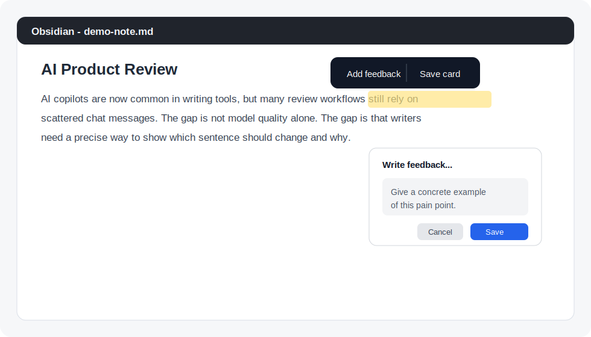
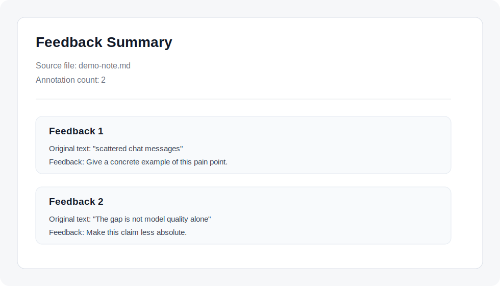
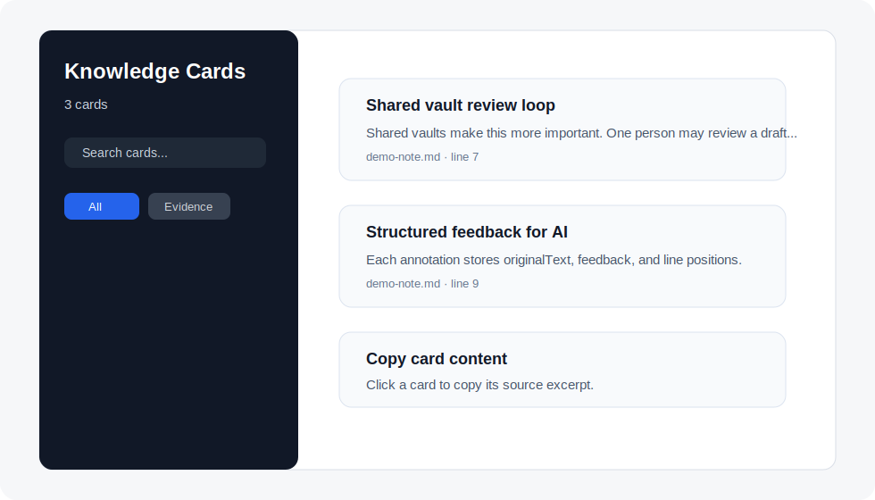

# Inline Feedback

Inline Feedback is an Obsidian plugin for precise feedback in Obsidian-based AI agent workflows.

When you use Codex, Claude Code (CC), OpenClaw, Hermes Agent, or another AI agent with Obsidian as the output surface, the hard part is often not whether the agent can generate or edit content. The hard part is making it understand exactly which line, paragraph, claim, plan, note, or section you are responding to.

Inline Feedback gives Obsidian a local feedback layer for that workflow. Select any Markdown text, attach precise feedback to that exact span, and save it beside the note so your agent can read it directly from the vault.

[中文说明](README.zh-CN.md)



## What It Does

- Select text in any Markdown note and attach precise feedback without rewriting the note.
- Save feedback next to the source note in `<note>.feedback.json`.
- Review, edit, delete, and navigate annotations from a sidebar.
- Let Codex, Claude Code, OpenClaw, Hermes Agent, and similar tools read feedback directly from the vault.
- Optionally export a readable Markdown summary only when an AI tool cannot access your local files.
- Append review items to `feedback_log.md` for project-level tracking.
- Save high-value excerpts as Knowledge Cards for reuse in later work.

Inline Feedback is useful for AI-assisted writing, research notes, specs, reports, plans, knowledge bases, shared vault review, and any workflow where Obsidian is the place you inspect AI output and give feedback back to an agent.

Instead of saying "look at this part" in chat, you mark the exact sentence, paragraph, checklist item, or section in Obsidian. Your agent can inspect the companion `.feedback.json` file and respond with much less guessing.

## Why It Exists

Markdown is excellent as an AI working surface, but it does not have a simple Google Docs-style comment layer that stays local, syncs with an Obsidian vault, and is easy for AI tools to consume. Inline Feedback fills that gap with plain local files:

```text
my-note.md
my-note.feedback.json
my-note.feedback_export.md
feedback_log.md
knowledge_cards/_library.json
knowledge_cards/_library.md
```

No server is involved. The plugin only writes files inside your vault.

## Screenshots

| Add precise feedback | Agent-readable feedback file |
| --- | --- |
|  |  |

| Knowledge Cards |
| --- |
|  |

The screenshots use the safe sample note in [`docs/demo-note.md`](docs/demo-note.md).

## Installation

Use BRAT. This is the simplest way to install the plugin before it is listed in the official Obsidian community plugin directory.

1. In Obsidian, install and enable the `BRAT` community plugin.
2. Open `BRAT` settings and choose `Add beta plugin`.
3. Paste this link:

```text
https://github.com/yuanhaozhou0509-cmyk/obsidian-inline-feedback
```

4. Confirm, then enable `Inline Feedback` in Obsidian community plugins.

Advanced manual install: download `main.js`, `manifest.json`, and `styles.css` from the latest GitHub Release and place them in `<vault>/.obsidian/plugins/inline-feedback/`.

## Basic Workflow

1. Open a Markdown note.
2. Select a sentence or paragraph.
3. Click `Add feedback` in the floating popup, or use the editor context menu.
4. Write feedback and press `Ctrl+Enter`.
5. Open the feedback panel from the ribbon icon or command palette if you want to review all feedback.
6. Ask your AI agent to read the `.feedback.json` next to the note and respond, revise, continue, or implement accordingly.
7. Export Markdown only if the AI tool cannot access your vault files directly.

Example instruction for an AI assistant or coding agent:

```text
Please continue from my-note.md according to my-note.feedback.json.
Address each feedback item precisely and preserve the original structure where possible.
For each annotation, use originalText as the target span and feedback as the requested change.
```

## Data Files

### `<note>.feedback.json`

```json
{
  "source": "my-note.md",
  "annotations": [
    {
      "id": "lxy123abc",
      "originalText": "The selected text",
      "feedback": "Make this claim more concrete.",
      "lineStart": 12,
      "lineEnd": 12,
      "charStart": 4,
      "charEnd": 21,
      "timestamp": "2026-05-07T12:00:00.000Z"
    }
  ]
}
```

### `<note>.feedback_export.md`

A readable Markdown summary for users who prefer to paste feedback into chat. This is optional; agents that can access your vault can use `<note>.feedback.json` directly.

### `feedback_log.md`

A lightweight table that collects feedback summaries across notes.

### `knowledge_cards/`

Knowledge Cards store reusable excerpts, keywords, categories, source note paths, source line numbers, and optional notes. The plugin generates both `_library.json` and `_library.md`.

## Privacy

Inline Feedback does not upload content. It has no backend and no telemetry. All annotations, exports, logs, images, and Knowledge Cards are stored in your local Obsidian vault and sync only through whatever sync tool you already use.

## Release Notes

This is a desktop-first `1.0.0` release. Mobile support is not claimed yet because the current UI has only been designed and tested for desktop Obsidian.

GitHub Releases should attach:

- `main.js`
- `manifest.json`
- `styles.css`

The release tag must match the `version` in `manifest.json`.

## License

MIT. See [LICENSE](LICENSE).


